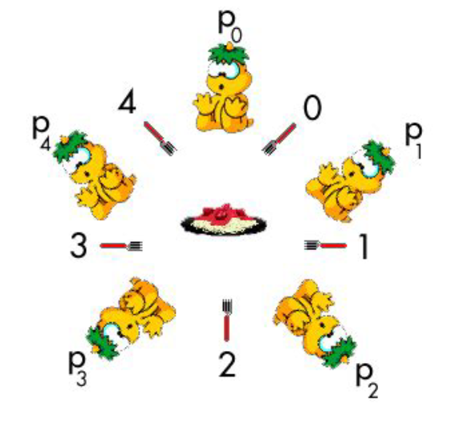

# Dining Philosophers Lab, Made by Kyle Kinsella | C00273146

# What is the dining philosophers problem?
### The dining philosophers problem is where we have a table of 0-4 philosophers and in between all of the philosophers there is a left and right fork and there is a piece of food at the middle of the table. 

# Rules
### 1. You need two forks to be able to eat 
### 2. It must be impossible to deadlock 
### 3. It must be possible for two philosophers to eat at the same time 
### 4. It must be impossible for a philosopher to starve

# Below is an image of the dining philosophers problem:

# How to run my code
### To run my code you must do the following:
#### 1. Download my go file
#### 2. Type in: Go run filename, change filename to be the name of the file

# Licensing
### All of this work I have completed is licensed with my below license.

This work by Kyle Kinsella is licensed under <a href="https://creativecommons.org/licenses/by-nc-sa/4.0/?ref=chooser-v1" target="_blank" rel="license noopener noreferrer" style="display:inline-block;">Creative Commons Attribution-NonCommercial-ShareAlike 4.0 International</a>
 